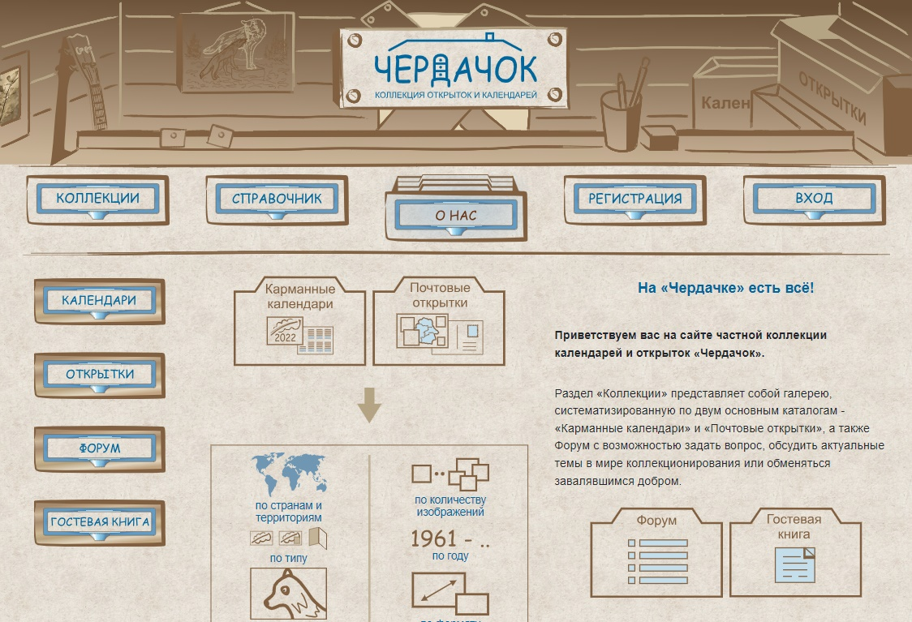

# Частная коллекция открыток и карманных календарей (HTML | CSS | JS | jQuery)

[Переключиться на английский | Switch to English](./readme.md)

## О проекте "Чердачок"
Сайт частной коллекции открыток и календарей. Первый учебный проект (2022 г.)

**Инструменты:** 

**Языки:** 
 
 
 
 

**Демо:** [Перейти на сайт](https://the-all-spark.github.io/postcards-calendars-collection/) 

## Реализованный функционал:
1. [верстка](#1---html-и-css): сверстаны общие для всех страниц header и footer, главная страница "О нас", страница "Открытки", формы обратной связи и "Оставить отзыв" (HTML, CSS);
2. [подсказки](#2---js): при наведении курсора мышки на категории открыток всплывают подсказки (JS);
3. [фильтры](#3---jquery): реализована фильтрация и сортировка открыток (jQuery);
4. [валидация](#b---форма-обратной-связи) формы обратной связи (jQuery);
5. [валидация](#c---форма-оставить-отзыв) формы "Оставить отзыв" (jQuery); 
6. [адаптивность](#4---адаптивность-верстки): верстка адаптирована под различную ширину экрана. 

## Подробнее о реализации:

### 1 - HTML и CSS 
 

  + **сверстаны элементы, общие для всех страниц:**
     * _header_:
         - изображения в шапке, меняющиеся в зависимости от ширины экрана (атрибуты `srcset` и `sizes` тега ``);
         - основное меню, оформленное в виде списка `<ul>`; кнопки - изображения (``) (активный пункт отображается в виде открытого ящика картотеки). Использовано свойство `grid`.
     * _footer_ (использовано свойство `grid`):
         - стилизованная шильда-копирайт;
         - иконки-ссылки на форму обратной связи и форму "Оставить отзыв";
         - иконки социальных сетей (использовано свойство `grid`).  
  + **сверстана главная страница "О нас"** (использовано свойство `grid`):  
     * _боковое меню_, оформленное в виде списка `<ul>`; кнопки - изображения (``). Использовано свойство `grid`;
     * _иконки_, соответствующие категориям открыток и календарей. При наведении всплывают подсказки (реализовано средствами **JS**, см. далее).
  + **сверстана страница "Открытки"** (галерея с возможностью сортировки и фиьтрации по параметрам):

### 2 - JS 
 

**Отображение подсказок к категориям открыток и календарей** - `script.js`

Подсказки представлены в виде объекта `tips`. Имена свойств объекта (country, type и т.д.) соответствуют значениям атрибута `data-tooltip` элементов `
` (вложены в блок `
`).

Если подсказка присутствует (проверяется содержимое `dataset.tooltip`), при наведении курсора мыши вызывается функция `explain`.

Функция `explain`:
 + получает координаты объекта, на который был наведен курсор мыши (`getBoundingClientRect()`);
 + получает доступ к контейнеру `container`, куда будет выводиться содержимое подсказки;
 + при наличии подсказки присваивает блоку `container` класс `tip` и стиль `display: block`;
 + определяет позицию элемента относительно документа с учетом прокрутки;
 + устанавливает значения свойств стиля `top` и `left`;
 + выводит соответствующую подсказку в `container`.
 + При уходе курсора мыши блок для вывода содержимого подсказки скрывается.  

### 3 - jQuery
 

### a - **Сортировка и фильтрация открыток на странице "Открытки"** - `scripts/script_jQ_plugin.js`
Используется плагин [Isotope (ссылка)](https://isotope.metafizzy.co/). 

### b - **Форма обратной связи** - `scripts/script_jQ_question.js`
  
Проверка заполнения полей формы на соответствие регулярным выражениям.

### c - **Форма "Оставить отзыв"** - `scripts/script_jQ_feedback.js`
  
Проверка заполнения полей формы на соответствие регулярным выражениям. После отправки отзыва выводится сообщение "Спасибо за ваш отзыв".

### 4 - **Адаптивность верстки** 

Верстка адаптирована под следующие размеры ширины экрана: 1900, 1500, 1200, 600, 480 и 280 px посредством медиа-запросов. Корректна для промежуточных размеров.

### Примечание
Все остальные страницы на данный момент находятся в разработке.

## Как запустить локально