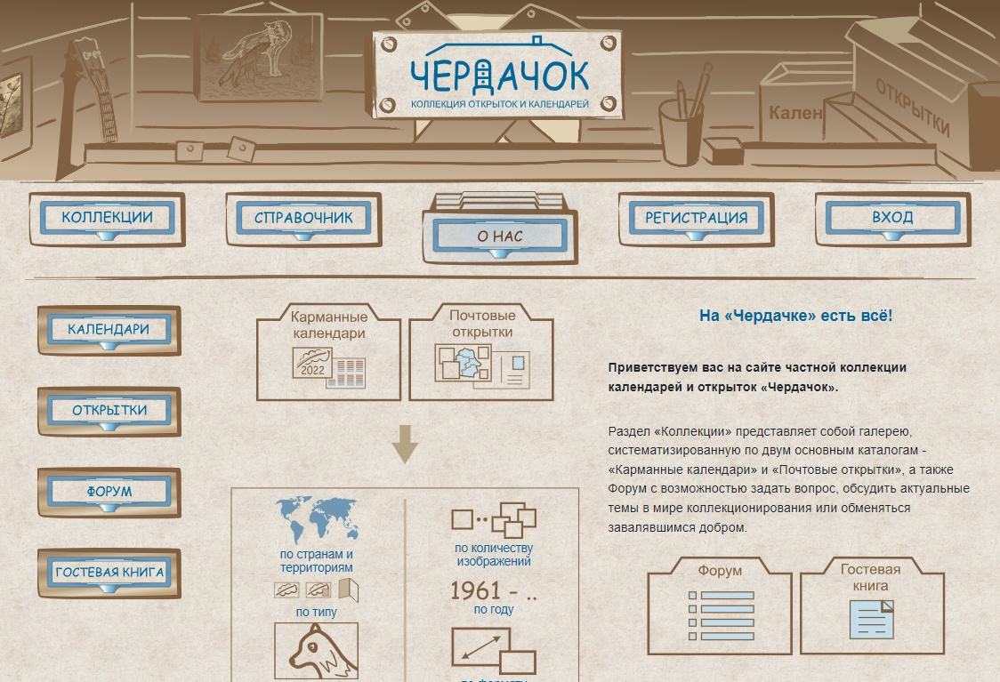

# Private collection of postcards and pocket calendars (HTML | CSS | JS | jQuery)

[Switch to Russian | Переключиться на русский](./README-ru.md)

## About the project
Site for the private collection of postcards and calendars. First training project (2022)

**Tools:** 

**Languages:** 
 
 
 
 

**Demo version:** [ to the site -->](https://the-all-spark.github.io/postcards-calendars-collection/) 

## Realized functionality:
1. _HTML and CSS coding_: coding of common for all pages blocks (header and footer), main page named "About Us", page named "Postcards", feedback and "Leave a Review" forms (HTML, CSS);
2. _hints_: hints pop up while hovering the mouse cursor over postcard categories (JS);
3. _filters_: filtering and sorting of postcards (jQuery);
4. _validation_ of feedback form by checking the correspondence with the regular expressions (jQuery);
5. _validation_ of "Leave a Review" form by checking the correspondence with the regular expressions (jQuery); 
6. _adaptivity_: HTML code is adapted for different screen widths.